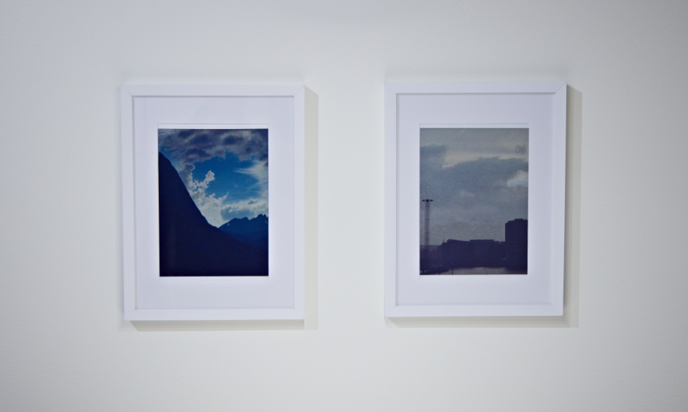

# E-ink Art Frame - Low-Power Picture Display

A low-power digital art frame that cycles through images stored on an SD card, displayed on a 6-color e-paper screen. The display retains its image indefinitely without power, making it ideal for an always-on picture frame. Supports both Waveshare and Pimoroni Inky Impression panels.



## Features

- Cycles through images stored on a microSD card
- 6-color e-paper display: black, white, yellow, red, blue, green
- Ultra-low power — display holds image without power between updates
- Three firmware variants: 4-inch Arduino R4, 13.3-inch Waveshare ESP32, 13.3-inch Inky Impression ESP32
- Custom PCB hardware designs included

---

## Hardware Variants

### 4-inch (Waveshare EPD-4in0e) — Arduino R4
- **Resolution:** 400 × 600 px
- **Controller:** Arduino UNO R4
- **Update interval:** every 4 minutes
- Firmware: [waweshare_Arduino_R4_4inch/](waweshare_Arduino_R4_4inch/)

### 13.3-inch (Waveshare EPD-13in3e) — ESP32
- **Resolution:** 1200 × 1600 px
- **Controller:** ESP32 (with PSRAM)
- **Update interval:** every 13 hours (deep sleep between updates)
- Firmware: [waweshare_ESP32_13inch/](waweshare_ESP32_13inch/)

### 13.3-inch (Pimoroni Inky Impression) — ESP32
- **Resolution:** 1200 × 1600 px
- **Controller:** ESP32 (with PSRAM)
- **Update interval:** every 13 hours (deep sleep between updates)
- **Display:** Pimoroni Inky Impression 13.3" (uses the same underlying panel as the Waveshare variant)
- **Difference from Waveshare variant:** skips the initial screen clear before rendering, avoiding a full white flash on each update
- Firmware: [inky_ESP32_13inch/](inky_ESP32_13inch/)

---

## Repository Structure

```
├── waweshare_Arduino_R4_4inch/   # Arduino R4 firmware for 4-inch Waveshare display
├── waweshare_ESP32_13inch/       # ESP32 firmware for 13-inch Waveshare display
├── inky_ESP32_13inch/            # ESP32 firmware for 13-inch Pimoroni Inky Impression
├── image_conversion/             # Python script to convert images for the display
│   ├── convert.py
│   ├── input/                    # Place source PNG files here
│   └── output/                   # Converted .bin files are written here
├── hardware/
│   ├── controller/               # KiCad controller PCB design + gerbers
│   └── shield/                   # KiCad shield PCB design
├── documentation/                # Waveshare datasheets and manuals
└── demo/                         # Vendor-provided reference demos
```

---

## Getting Started

### 1. Convert Images

Images must be pre-converted to a packed binary format before being loaded onto the SD card.

**Requirements:** Python 3, Pillow (`pip install Pillow`)

```bash
cd image_conversion
# Place your PNG files in the input/ folder
python convert.py
# Output .bin files will appear in output/
```

The script quantizes each image to the 6-color palette, then packs 2 pixels per byte (4 bits each) to produce a `.bin` file. A palette-quantized `.bmp` preview is also saved alongside each `.bin`.

**Image dimensions must match the display:**
- 4-inch: 400 × 600 px
- 13-inch: 1200 × 1600 px

### 2. Prepare the SD Card

Copy the converted `.bin` files to the root of a FAT32-formatted microSD card, then create two text files:

**`files.txt`** — comma-separated list of filenames to display:
```
image1.bin,image2.bin,image3.bin
```

**`config.txt`** — current image index (start with `0`):
```
0
```

The firmware reads the current index from `config.txt`, displays that image, increments the index (wrapping around at the end of the list), and writes it back before sleeping.

### 3. Flash the Firmware

Open the appropriate sketch in the Arduino IDE:
- **4-inch Waveshare:** `waweshare_Arduino_R4_4inch/Arduino_R4_4inch.ino`
- **13-inch Waveshare:** `waweshare_ESP32_13inch/waweshare_ESP32_13inch.ino`
- **13-inch Inky Impression:** `inky_ESP32_13inch/inky_ESP32_13inch.ino`

Flash to your board using the Arduino IDE.

---

## Pin Connections

### Arduino R4 (4-inch display)

| Signal   | Arduino Pin |
|----------|-------------|
| SCK      | 13          |
| MOSI     | 11          |
| EPD CS   | 10          |
| DC       | 9           |
| RST      | 8           |
| BUSY     | 7           |
| PWR      | 6           |
| SD CS    | 4           |

### ESP32 (13-inch Waveshare and Inky Impression — same pins)

| Signal   | ESP32 Pin |
|----------|-----------|
| SCK      | 18        |
| MOSI     | 23        |
| MISO     | 19        |
| EPD CS_M | 2         |
| EPD CS_S | 13        |
| DC       | 14        |
| RST      | 0         |
| BUSY     | 26        |
| PWR      | 25        |
| SD CS    | 17        |

The 13-inch display uses dual SPI chip selects (CS_M and CS_S) to address the left and right halves of the panel independently.

---

## Color Palette

| Color  | 3-bit Code | RGB            |
|--------|-----------|----------------|
| Black  | `0x0`     | (0, 0, 0)      |
| White  | `0x1`     | (255, 255, 255)|
| Yellow | `0x2`     | (255, 255, 0)  |
| Red    | `0x3`     | (255, 0, 0)    |
| Blue   | `0x5`     | (0, 0, 255)    |
| Green  | `0x6`     | (0, 255, 0)    |

Pixels are packed two per byte: `[pixel_n (4 bits) | pixel_n+1 (4 bits)]`.

---

## Hardware

Custom PCB designs are provided in [hardware/](hardware/) (KiCad format):
- **controller/** — main controller board with gerbers ready for fabrication
- **shield/** — e-paper display shield/adapter

Waveshare schematics and datasheets are in [documentation/](documentation/).

---

## Dependencies

- [Waveshare e-Paper Arduino libraries](https://github.com/waveshareteam/e-Paper) (driver files included in each firmware folder)
- Arduino IDE with ESP32 board support (for 13-inch variant)
- Arduino UNO R4 board support (for 4-inch variant)
- Python + Pillow (for image conversion)
